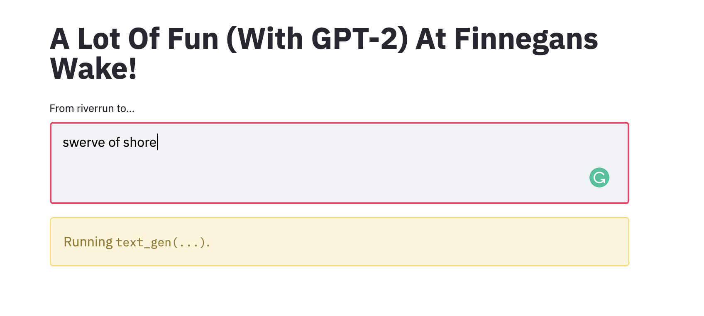
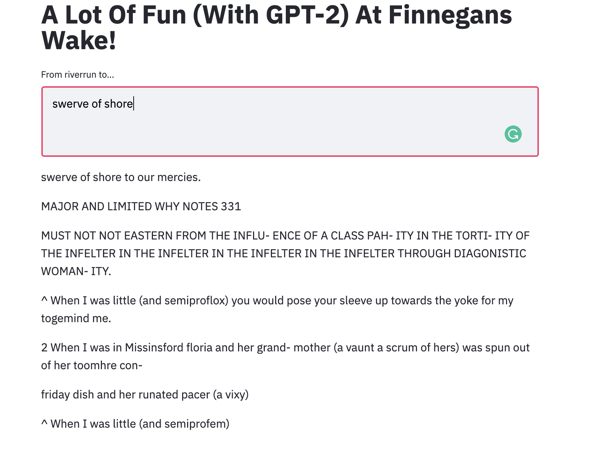

# A Lot Of Fun (With GPT-2) At Finnegans Wake!

**A Lot Of Fun...** is a Natural Language Processing text generation data science app in Python using _Streamlit and GPT-2 Simple_ (all credit where credit is due to Max Woolf, support his Patreon at https://www.patreon.com/minimaxir! Seriously talented and funny person and the brains behind a lot of great GPT-2 stuff.)

The generator is trained off of the text of _Finnegans Wake_ by James Joyce, a book that is one of the most linguistically dense, Wakeish-not-English English canonical modern classics. Its unique language and structure was part of what drew me to NLP a long time ago, to see if models could model the modeling Joyce was doing of the superstructures and strata of language and mythos, and I want to say GPT-2 does a decent job of Joyceish.

Also, I wanted to try out Streamlit with some deep learning, as I'd just used it for simple basically toy visualizations before.

**NOTE**: I am still dealing with some technical issues, standby, regarding getting the model itself hosted. You can contact me for the model, I suppose, or create one with this amazing Google Colab notebook by guess who, Max Woolf -- https://colab.research.google.com/drive/1VLG8e7YSEwypxU-noRNhsv5dW4NfTGce off the text of the book, placing it conventionally in checkpoint/run1 in the folder structure. Soon hopefully that'll get resolved and this will be up and deployed. Also I've got to clean up the base text, there's a lot of artifacts of grabbing the first text file of the Wake I could find in my rush to finally make this thing. _Stay tuned is what I'm getting at!_

To get started, pip install -r that requirements.txt right there, streamlit run app.py, but make sure you have a fine-tuned model first! I used the Internet Archive's text version of the Wake, if that helps guide ya along the River Liffey.

**"And the signifieds butt heads**
**with the signifiers,**
**and we all fall down slack-jawed**
**to marvel at words!"** -- Joanna Newsom, "This Side of the Blue", who definitely read some Joyce in her time(see "Divers", a perfect companion piece to the Wake.)
